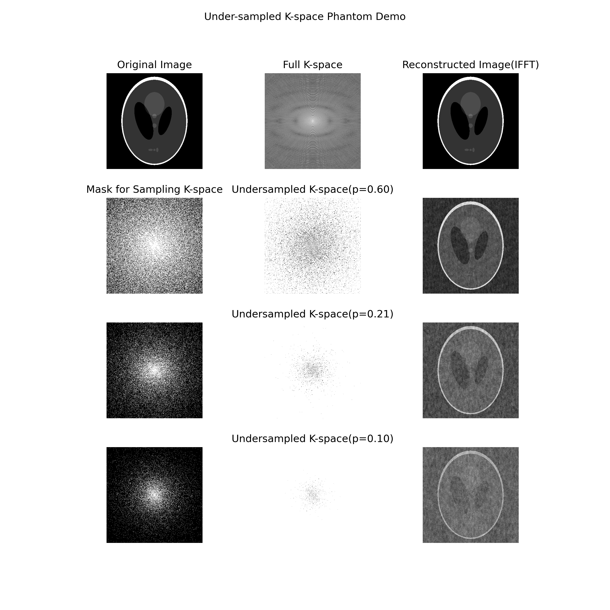

# ESE586-project

## Paper lists

#### MRI Basics
- [MRI tutorials](https://www.mriquestions.com/index.html)

#### Motion-Correction & Parallel Imaging 
- [ESPIRiT--an eigenvalue approach to autocalibrating parallel MRI: where SENSE meets GRAPPA](https://pubmed.ncbi.nlm.nih.gov/23649942/)
- [Structured Low-Rank Algorithms: Theory, Magnetic Resonance Applications, and Links to Machine Learning](https://pubmed.ncbi.nlm.nih.gov/35027816/)
- [Deep J-Sense: Accelerated MRI Reconstruction via Unrolled Alternating Optimization](https://www.ncbi.nlm.nih.gov/pmc/articles/PMC8767765/)
- [PALMNUT: An Enhanced Proximal Alternating Linearized Minimization Algorithm with Application to Separate Regularization of Magnitude and Phase](https://www.ncbi.nlm.nih.gov/pmc/articles/PMC8386764/)
- [Motion compensated generalized reconstruction for free-breathing dynamic contrast-enhanced MRI](https://onlinelibrary.wiley.com/doi/full/10.1002/mrm.22644)
- [Physics-based reconstruction methods for magnetic resonance imaging](https://www.ncbi.nlm.nih.gov/pmc/articles/PMC8107652/)
- [Efficient Regularized Field Map Estimation in 3D MRI](https://www.ncbi.nlm.nih.gov/pmc/articles/PMC7943027/)
- [Improved simultaneous multislice cardiac MRI using readout concatenated k-space SPIRiT (ROCK-SPIRiT)](https://onlinelibrary.wiley.com/doi/10.1002/mrm.28680)

#### Optimization & Machine Learning
- [Plug-and-Play Priors for Model Based Reconstruction](https://engineering.purdue.edu/~bouman/Plug-and-Play/webdocs/GlobalSIP2013a.pdf)
- [Plug-and-play methods provably converge with properly trained denoisers](https://arxiv.org/pdf/1905.05406.pdf)
- [ISTA-Net: Interpretable Optimization-Inspired Deep Network for Image Compressive Sensing](https://arxiv.org/pdf/1706.07929.pdf)
- [Deep ADMM-Net for Compressive Sensing MRI](https://papers.nips.cc/paper/2016/file/1679091c5a880faf6fb5e6087eb1b2dc-Paper.pdf)
- [MoDL: Model Based Deep Learning Architecture for Inverse Problems](https://arxiv.org/pdf/1712.02862.pdf)
- [Deep Residual Learning for Accelerated MRI using Magnitude and Phase Networks](https://arxiv.org/pdf/1804.00432.pdf)
- [Noise2Noise: Learning Image Restoration without Clean Data](https://arxiv.org/pdf/1803.04189.pdf)
- [J-MoDL: Joint Model-Based Deep Learning for Optimized Sampling and Reconstruction](https://www.ncbi.nlm.nih.gov/pmc/articles/PMC7893809/)
- [The Little Engine that Could: Regularization by Denoising (RED)](https://arxiv.org/abs/1611.02862)

#### Key Paper Options
- [Eigenvector-based SPIRiT Parallel MR Imaging Reconstruction based on ℓp pseudo-norm Joint Total Variation](https://www.sciencedirect.com/science/article/abs/pii/S0730725X18305733)
- [Noise2Noise: Learning Image Restoration without Clean Data](https://arxiv.org/pdf/1803.04189.pdf)
- [Noise2Void - Learning Denoising from Single Noisy Images](https://arxiv.org/pdf/1811.10980.pdf)

#### Sparse MRI Reconstruction Review Papers
- [Sparse Reconstruction Techniques in Magnetic Resonance Imaging](https://journals.lww.com/investigativeradiology/Fulltext/2016/06000/Sparse_Reconstruction_Techniques_in_Magnetic.1.aspx)
- [Reducing acquisition time in clinical MRI by data undersampling and compressed sensing reconstruction](https://iopscience.iop.org/article/10.1088/0031-9155/60/21/R297)
- [Compressed sensing MRI: a review from signal processing perspective](https://www.ncbi.nlm.nih.gov/pmc/articles/PMC7412677/)
- [Sparse Reconstruction Techniques in MRI: Methods, Applications, and Challenges to Clinical Adoption](https://www.ncbi.nlm.nih.gov/pmc/articles/PMC4948115/)

#### Deep-learning based Sparse MRI reconstruction
- [AI-Based Reconstruction for Fast MRI—A Systematic Review and Meta-Analysis](https://ieeexplore.ieee.org/abstract/document/9703109)
- [Accelerating magnetic resonance imaging via deep learning](https://ieeexplore.ieee.org/abstract/document/7493320)
- [Deep residual learning for compressed sensing MRI](https://ieeexplore.ieee.org/document/7950457)

#### Low-field MRI
- [Deep Learning–based Method for Denoising and Image Enhancement in Low-Field MRI](https://ieeexplore.ieee.org/abstract/document/9651441?casa_token=6fZwjoxnvE0AAAAA:nGtNBTksUmuSoW9RwaFZQghu4COz5TcKoSK2o331xhH7m3YttDq9n49dNZyZplqpFeg80GPmTtue)
- [Deflated preconditioned Conjugate Gradient methods for noise filtering of low-field MR images](https://www.sciencedirect.com/science/article/pii/S0377042721003526)
- [A Dictionary Learning Approach for Joint Reconstruction and Denoising in Low Field Magnetic Resonance Imaging](https://ieeexplore.ieee.org/abstract/document/9576932?casa_token=c8lsd383K34AAAAA:bs1SuWhNDUFeadcF9_hkRfkeWZ7GHRPXHWHi5c9A40JMShPWEPC7hfKg__1t6qtDFaC18cpjDQUI)
- [Low-Field MRI: How Low Can We Go? A Fresh View on an Old Debate](https://www.frontiersin.org/articles/10.3389/fphy.2020.00172/full)

#### Motion artifact simulation for MRI image
- [Deep Learning in MR Motion Correction: a Brief Review and a New Motion Simulation Tool (view2Dmotion)](https://pc.i-mri.org/pdf/10.13104/imri.2020.24.4.196)
- Matlab code of view2Dmotion (https://github.com/Yonsei-MILab/MRI-Motion-Artifact-Simulation-Tool)

## Open MRI Datasets
- [fastMRI](https://fastmri.med.nyu.edu)
  - [paper](https://arxiv.org/abs/1811.08839)
- [IXI Dataset](http://brain-development.org/ixi-dataset/)

## Demo Under-sampled K-space with a Bernoulli process

## To-Do Lists
- [ ] 1. Train Noise2Noise
- [ ] 2. Train a UNet for image denoising
- [ ] 3. Implement quantative evaluation
